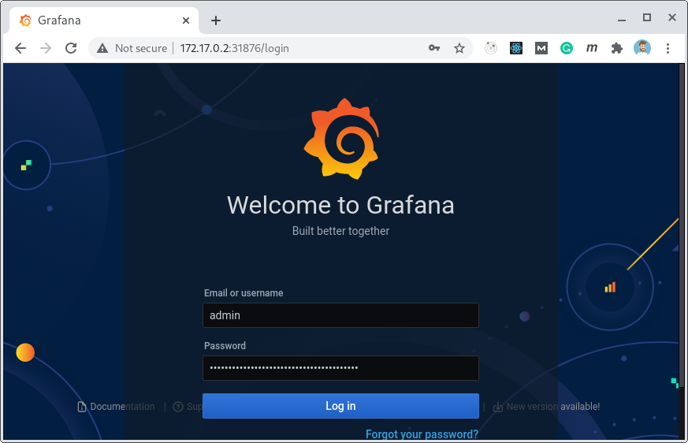
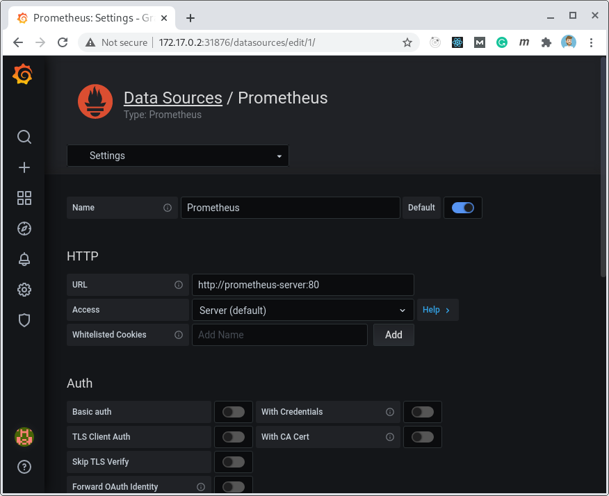
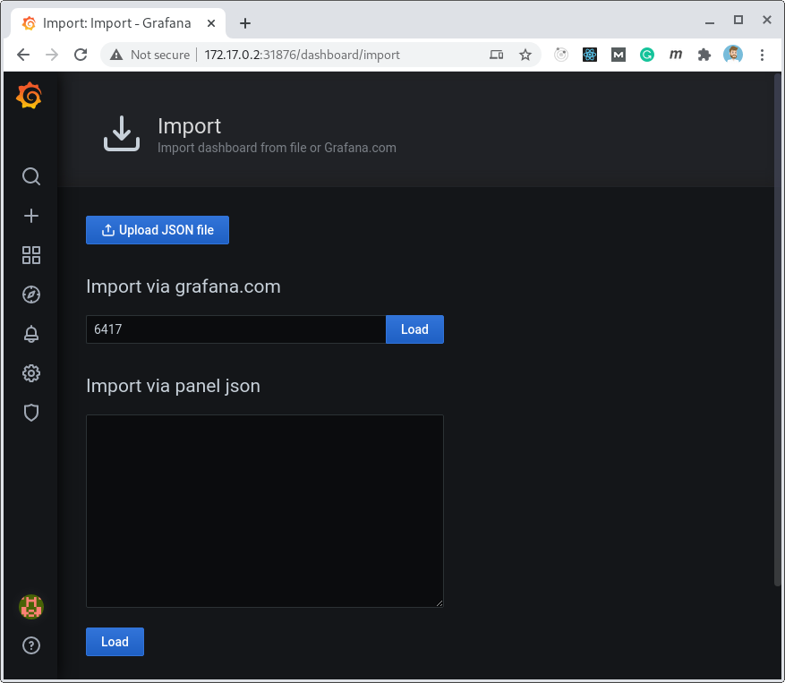
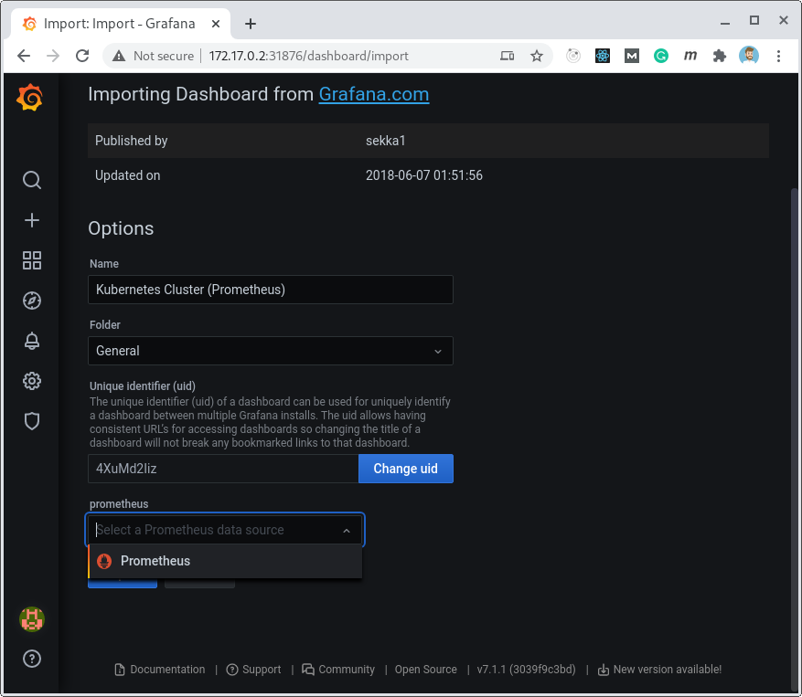
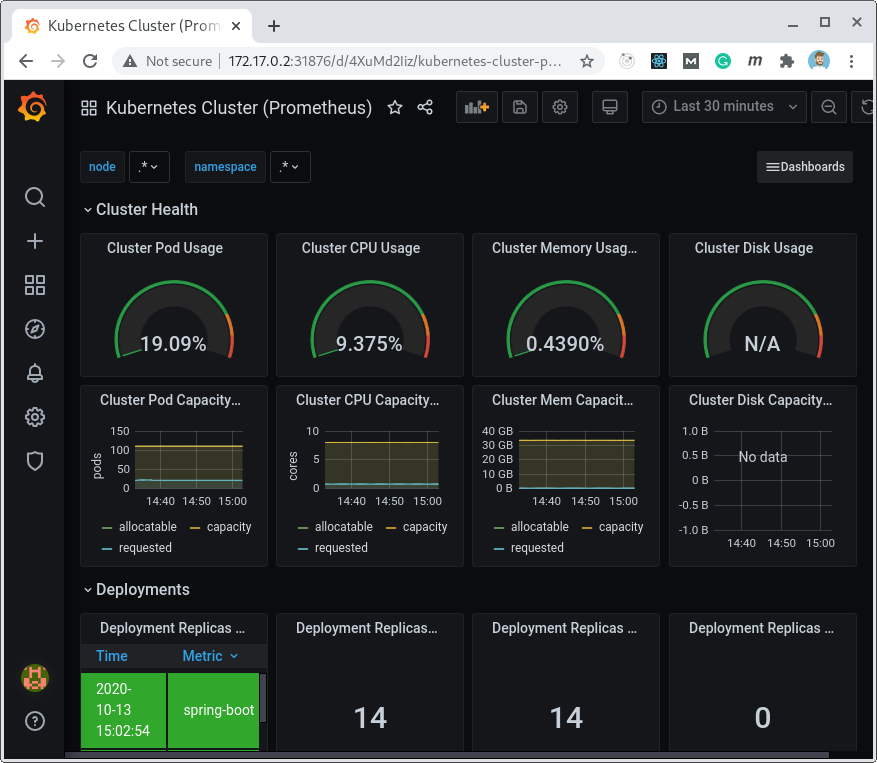

# MongoDB X

Como instalar o
[MongoDB Community](https://github.com/mongodb/mongodb-kubernetes-operator) com a monitoração do
[Grafana](https://grafana.com/) +
[Prometheus](https://prometheus.io/) no
[Minikube](https://minikube.sigs.k8s.io/docs/start/) usando também o
[Helm](https://helm.sh/).

Requisitos:
1. [Minikube](https://minikube.sigs.k8s.io/)
2. [Helm](https://helm.sh/)
3. Os arquivos deste repositório

## Instalar Minikube
[instale o minikube seguindo a documentação](https://minikube.sigs.k8s.io/docs/start/).

Inicie o minikube:

   ```
   minikube start
   ```

## Instalar Helm Charts
[instale o helm seguindo a documentação](https://helm.sh/docs/intro/install/).

## Instalar MongoDB Community
Após instalar e rodar o minikube, crie os recursos utilizando o YAMLs aqui presentes para instalar o 
operador
do
[MongoDB Community](https://github.com/mongodb/mongodb-kubernetes-operator) com um
[ReplicaSet](https://kubernetes.io/docs/concepts/workloads/controllers/replicaset/) de exemplo.
O usuário é `admin` e a senha `password`.
Você pode alterar os arquivos de acordo com o que desejar.

   ```
   minikube kubectl -- create -f ./
   ```

## Prometheus
Para adicionar o
[Prometheus](https://prometheus.io/)
utilizamos o
[helm chart](https://helm.sh/) provido pela comunidade execute os comandos:
   ```
   helm repo add prometheus-community https://prometheus-community.github.io/helm-charts
   helm install prometheus prometheus-community/prometheus
   minikube kubectl -- expose service prometheus-server --type=NodePort --target-port=9090 --name=prometheus-server-np
   ```

Os dois primeiros comandos instala o chart do
[Prometheus](https://prometheus.io/).
O terceiro comando expoe o prometheus-server usando um
[NodePort](https://kubernetes.io/docs/concepts/services-networking/service/).
Desta forma podemos acessar a interface web do Prometheus utilizando a a porta criada.

   ```
   minikube service prometheus-server-np
   ```

## Grafana
Para adicionar o
[Grafana](https://grafana.com/)
utilizamos o
[helm chart](https://helm.sh/) provido pela comunidade execute os comandos:

   ```
   helm repo add grafana https://grafana.github.io/helm-charts
   helm install grafana grafana/grafana
   minikube kubectl -- expose service grafana --type=NodePort --target-port=3000 --name=grafana-np
   ```

Da mesma forma que fizemos para o Prometheus, instalamos o chart com os dois primeiros comandos e com o terceiro expomos
a interface web com um
[NodePort](https://kubernetes.io/docs/concepts/services-networking/service/).

Observe que o Grafana é protegido por senha. Para obter a senha do usuário `admin` utilize o seguinte comando:
   ```
   minikube kubectl -- get secret --namespace default grafana -o jsonpath="{.data.admin-password}" | base64 --decode ; echo
   ```

Para obter o endereço do Grafana use o comando:

   ```
   minikube service grafana-np
   ```



# Configurar Prometheus Datasource no Grafana
Após logar na interface do grafana, adicione o prometheus como datasource:
Configuration > Datasources e adicione uma instancia Prometheus.



A URL para o prometheus contem o nome do serviço é `http://prometheus-server:80`

## Kubernetes Dashboard
Agora, configurar um dashboard para o kubernetes providos pela comunidade.
Neste momento vamos utilizar o  https://grafana.com/grafana/dashboards/7249

(+) > Import via grafana.com e digite o ID `7249` no campo e click em load.



Na configuração do dashboard selecionamos o datasource do Prometheus criado anteriormente.



Após confirmar a importação, seremos direcionados para o dashboard.



Se tudo estiver ok, veremos informações do nosso cluster do minikube.

## MongoDB Dashboards

```
minikube kubectl -- expose service mongodb-exporter --type=NodePort --target-port=9001 --name=mongodb-exporter-np
```